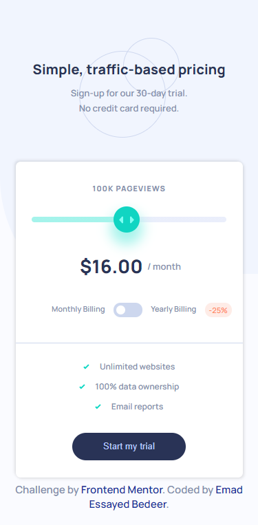
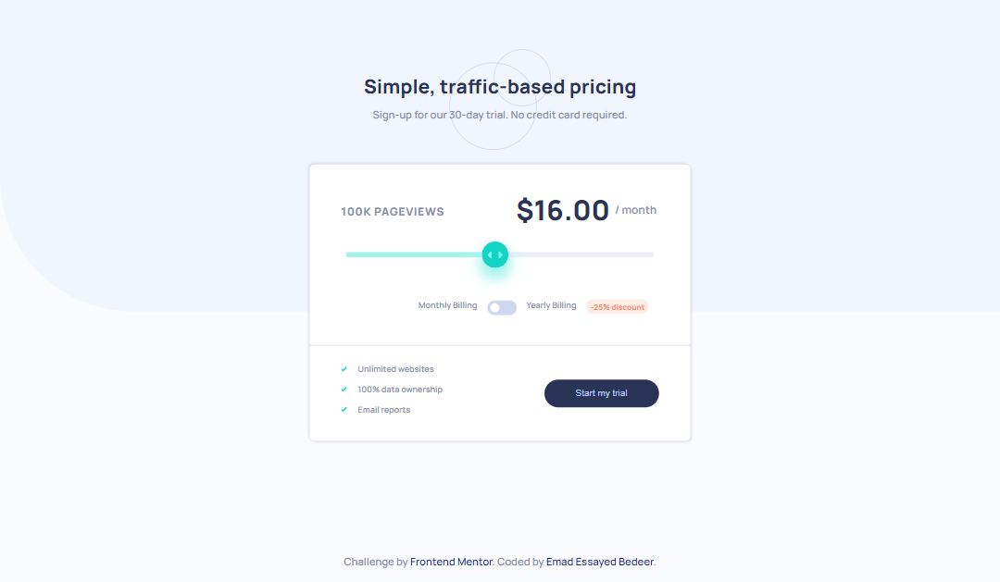

# Frontend Mentor - Interactive pricing component solution

This is a solution to the [Interactive pricing component challenge on Frontend Mentor](https://www.frontendmentor.io/challenges/interactive-pricing-component-t0m8PIyY8). Frontend Mentor challenges help you improve your coding skills by building realistic projects.

## Table of contents

- [Overview](#overview)
  - [The challenge](#the-challenge)
  - [Screenshot](#screenshot)
  - [Links](#links)
- [My process](#my-process)
  - [Built with](#built-with)
- [Author](#author)

## Overview

### The challenge

Users should be able to:

- View the optimal layout for the app depending on their device's screen size
- See hover states for all interactive elements on the page

### Screenshot

### Links

Solution URL: [https://github.com/Emad-Essayed/Frontend-Mentor-Interactive-pricing-component](https://github.com/Emad-Essayed/Frontend-Mentor-Interactive-pricing-component)

- Live Site URL: [https://emad-essayed.github.io/Frontend-Mentor-Interactive-pricing-component/](https://emad-essayed.github.io/Frontend-Mentor-Interactive-pricing-component/)

## My process

### Built with

- Semantic HTML5 markup
- [Saas](https://sass-lang.com/) - CSS preprocessor
- Flexbox
- Mobile-first workflow
- Javascript

## Author

- Website - [Emad Esaayed Bedeer](https://github.com/Emad-Essayed)
- Frontend Mentor - [@Emad Bedeer](https://www.frontendmentor.io/profile/Emad-Essayed)
- LinkedIn - [@Emad Bedeer](https://www.linkedin.com/in/emad-bedeer-4b1797106/)
